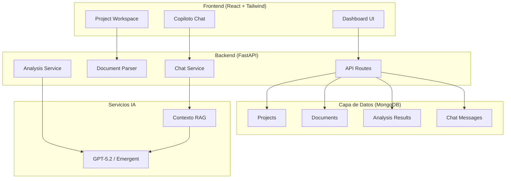
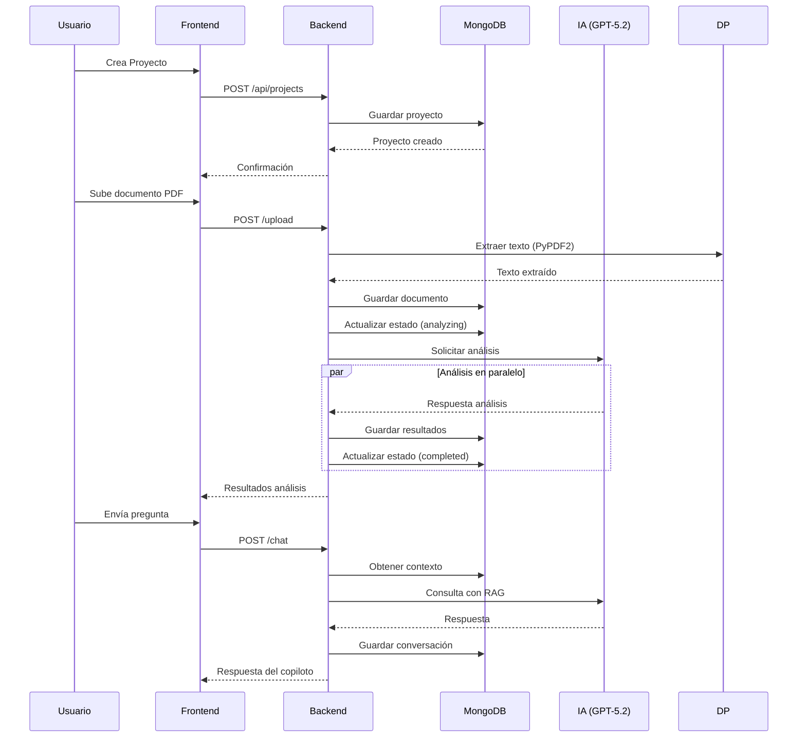
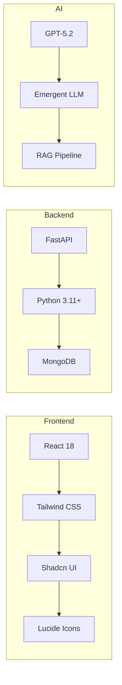
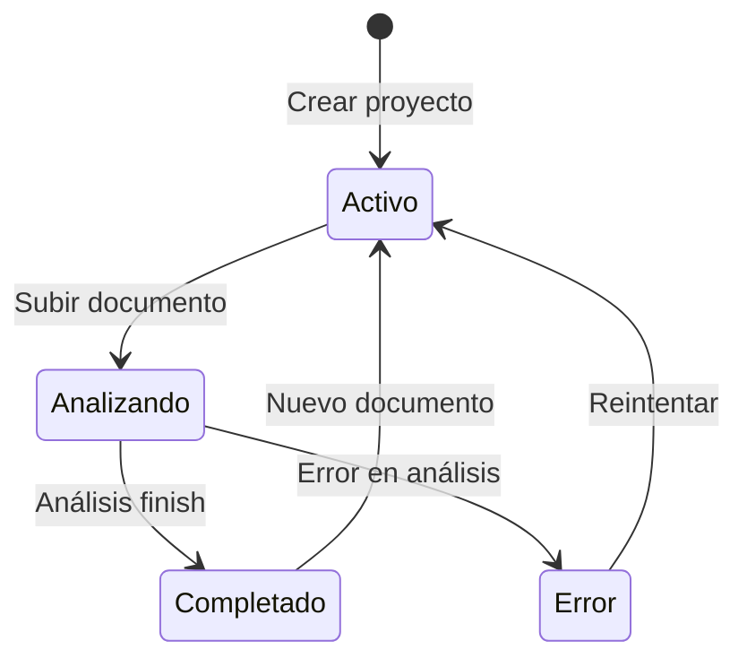
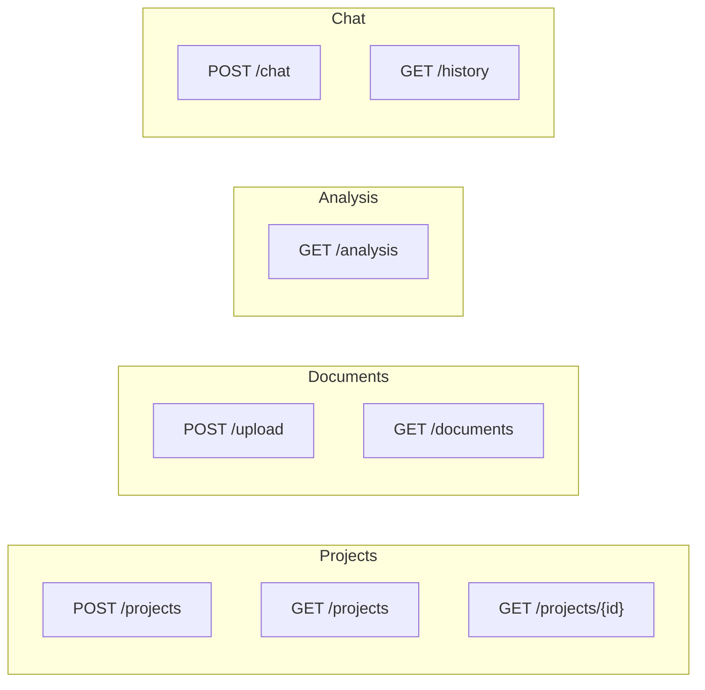

# 🤖 Copiloto de Ingeniería Eléctrica - GProA

Sistema inteligente de análisis de proyectos eléctricos con IA, basado en TwinKnowledge para validación normativa y detección de errores.


---

## 📋 Descripción

**GProA_BIMIA** es un sistema de copiloto de IA especializado en ingeniería eléctrica que:

- ✅ Analiza documentos técnicos (PDFs, memorias de cálculo, planos)
- ✅ Detecta errores eléctricos y violaciones normativas
- ✅ Evalúa cumplimiento con NOM-001-SEDE
- ✅ Actúa como ingeniero eléctrico senior
- ✅ Proporciona recomendaciones técnicas accionables

---

## 🏗️ Arquitectura del Sistema



---

## 🔄 Flujo de Trabajo



---

## 🗂️ Estructura del Proyecto

```
GProA_BIMIA/
├── backend/
│   ├── server.py          # API FastAPI completa
│   ├── requirements.txt   # Dependencias Python
│   └── .env              # Variables de entorno
├── frontend/
│   ├── src/
│   │   ├── App.js        # Componentes React
│   │   ├── App.css      # Estilos
│   │   └── components/  # Componentes UI (Shadcn)
│   ├── package.json
│   └── public/
├── tests/
│   └── __init__.py
├── memory/
└── test_reports/
```

---

## 🛠️ Stack Tecnológico



| Capa | Tecnología |
|------|-------------|
| **Frontend** | React 18, Tailwind CSS, Shadcn UI, Lucide Icons |
| **Backend** | FastAPI, Python 3.11+, Pydantic |
| **Base de Datos** | MongoDB (Motor async) |
| **IA** | GPT-5.2 via Emergent LLM |
| **Procesamiento** | PyPDF2 para PDFs |

---

## 📊 Estados del Proyecto



| Estado | Descripción |
|--------|-------------|
| 🟢 **Activo** | Proyecto creado, esperando documentos |
| 🟡 **Analizando** | Documento en procesamiento con IA |
| ✅ **Completado** | Análisis terminado |
| 🔴 **Error** | Fallo en el procesamiento |

---

## 🔌 Endpoints API



| Método | Endpoint | Descripción |
|--------|----------|-------------|
| `POST` | `/api/projects` | Crear proyecto |
| `GET` | `/api/projects` | Listar proyectos |
| `GET` | `/api/projects/{id}` | Obtener proyecto |
| `POST` | `/api/projects/{id}/upload` | Subir documento PDF |
| `GET` | `/api/projects/{id}/documents` | Listar documentos |
| `GET` | `/api/projects/{id}/analysis` | Ver análisis |
| `POST` | `/api/projects/{id}/chat` | Enviar mensaje |
| `GET` | `/api/projects/{id}/chat/history` | Historial |

---

## 🎨 Diseño y UX

### Paleta de Colores

| Propósito | Color | Uso |
|-----------|-------|-----|
| Primary | `#002FA7` | Botones, headers |
| Background | `#FAFAFA` | Fondo general |
| Surface | `#FFFFFF` | Cards, paneles |
| Error | `#DC2626` | Errores críticos |
| Warning | `#D97706` | Advertencias |
| Success | `#059669` | Cumplimiento |

### Tipografía

- **Títulos**: Chivo
- **Cuerpo**: IBM Plex Sans  
- **Técnico**: IBM Plex Mono

---

## 🚀 Instalación y Ejecución

### Backend

```bash
cd backend
python -m venv venv
source venv/bin/activate  # Windows: venv\Scripts\activate
pip install -r requirements.txt
python server.py
```

### Frontend

```bash
cd frontend
npm install
npm start
```

### Variables de Entorno

```env
MONGO_URL=mongodb://localhost:27017
DB_NAME=gproa_bimia
EMERGENT_LLM_KEY=your_key_here
CORS_ORIGINS=*
REACT_APP_BACKEND_URL=http://localhost:8000
```

---

## 📈 Funcionalidades del Copiloto

```
Copiloto IA
├── Análisis Técnico
│   ├── Detección de errores
│   ├── Evaluación normativa
│   └── Recomendaciones
├── Chat Contextual
│   ├── Historial conversacional
│   ├── Contexto de documentos
│   └── RAG Pipeline
└── Cumplimiento
    ├── NOM-001-SEDE
    ├── Normas eléctricas
    └── Seguridad
```

---

## 🔒 Normativas Soportadas

- **NOM-001-SEDE** - Instalaciones eléctricas
- **NOM-019-SCFI** - Equipos eléctricos
- **NEC (National Electrical Code)**
- **IEEE Standards**

---

## 📝 Licencia

MIT License - GProA Technology

---

## 🤝 Contribuidores

Desarrollado por **GProA Technology** - Ingeniería Eléctrica Asistida por IA

---

*Documentación generada para GitHub - Compatible con MDX y Mermaid*